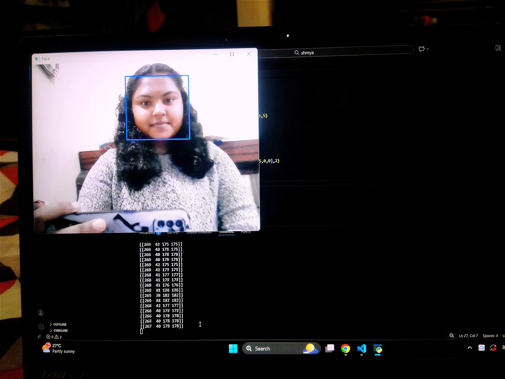

# Live_Camera_Python
A simple Python project that accesses and displays live webcam feed using OpenCV. This project demonstrates real-time camera handling and serves as a foundation for computer vision applications.
This project demonstrates how to access and display a live webcam feed using Python and OpenCV. It captures real-time video frames from the system camera and displays them on the screen. The project is useful as a base for advanced computer vision applications such as face detection, eye blink detection, and motion tracking.
🔹 Technologies Used
Python
OpenCV
🔹 Key Features
Real-time webcam access
Smooth live video streaming
Lightweight and beginner-friendly
Extendable for computer vision projects

